# 设计模式

## 一. 基础

### 1.1 UML类图说明

首先来了解一下uml符号的意思

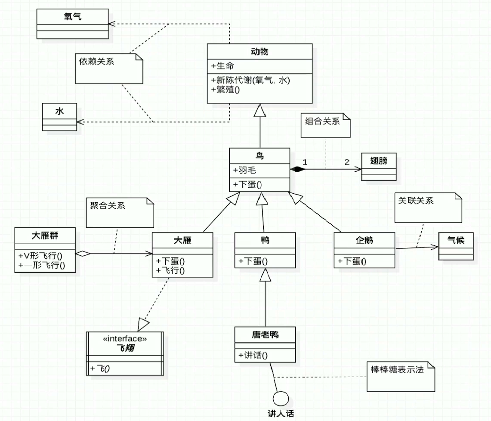

### 1.2 六大原则

- 单一职责：方法、类、接口单一
- 里氏替换：父类出现的地方都能透明的使用其子类
  - 覆盖或者实现父类的方法数**输入参数可以被放大**
  - 覆盖或者实现父类的方法时**返回值类型可以被缩小**
- 依赖倒置：面向接口编程（IOP——Interface-Oriented Programming），广泛引用于测试驱动开发（TDD），使用Mock数据开发
  - 高层模块不应该依赖底层模块，两者都应该依赖抽象：模块之间的依赖性通过抽象发生，实现类之间不发生直接的依赖关系
  - 抽象不应该依赖细节：接口或者抽象类不依赖具体实现类
  - 细节应该依赖抽象：实现类依赖接口或者抽象类
- 接口隔离：类间的依赖关系应该是建立在最小接口之上的，或者说：客户端应该依赖它不需要的接口（因为这些不需要的接口可能对它来说是没有权限的，不安全的等等）

- 迪米特法则：最小知道原则，不要和陌生人说话（只和直接朋友交流）

- 开闭原则：对拓展开放，对修改关闭：通过拓展软件的实体行为来实现变化，而不是通过修改已有的代码来实现变化。其它所有原则都是为该原则服务。

## 二. 创建型

### 2.1 简单工厂

注意严格上**简单工厂并不属于23中设计模式**，这里只是为了对比。

客户端使用参数直接依赖简单工厂，由简单工厂负责创建，但是该工厂职责过重，使用参数来决定创建对应实例违背开闭原则（可以使用反射减少if-else的使用）

**源码体现**

- Calendar类的createCalendar()方法
- log4j中，LoggerFactory的getLogger()方法

### 2.2 工厂方法

工厂方式：缓解简单工厂责任过重的问题，具体来说：

定义了一个用来创建对象的接口，让子类去决定实例化哪一个类。工厂方法是一个类的实例化**延迟**到其子类中。

注意：工厂方法主要在同一产品等级下进行的，当范围扩展到同一产品族下时，工厂方法容易出现**类爆炸**的情况。

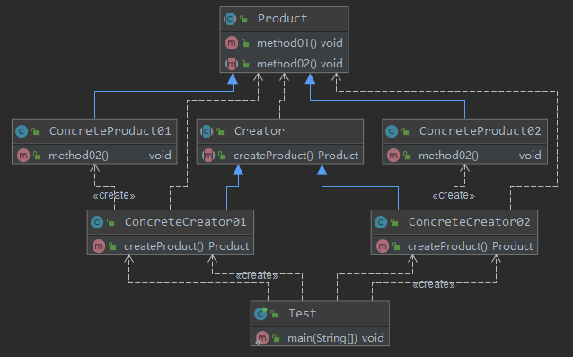

**源码体现**

- Collection类中iterator()方法：Collection对应Product角色，iterator对应抽象方法，由具体类（ArrayList、LinkedList等）去实现，最终生产一个Iterator对象。
- URLStreamHandlerFactory&URLStreamHandler类：
  - URLStreamHandlerFactory：抽象工厂，由 Launcher类的静态内部类实现该接口，并返回URLStreamHandler类的产品
  - URLStreamHandler：具体的产品包括http、ftp、file等

- SLF4J的ILoggerFactory&Logger接口

  - ILoggerFactory：抽象工厂，有三个抽象类（LoggerContext、NOPLoggerFactory、SubstituteLoggerFacotry）实现getLogger()方法，getLogger()方法返回抽象的Logger产品
- Logger：抽象产品类，具体产品类包括Logger、NOPLogger、SubstitudeLogger等
  
  

### 2.3 抽象工厂

工厂方法针对同一产品等级，当产品类中需要新增新的产品等级时候，会产生类爆炸问题。抽象工厂设计模式针对同一产品组族，但是该产品族需要实现规定好所有可能被创建的产品集合，因为在产品族中在继续拓展新的产品困难，需要修改抽象工厂的接口，不满足开闭原则。客户端程序只需要依赖同一产品族的抽象工厂即可，并不关心具体产品是如何产生的。

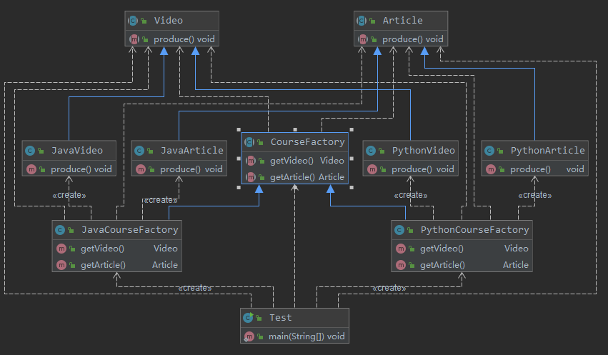

**源码体现**

- java.sql.Connection接口中createStatement()、prepareStatement()返回的Statement对象和prepareStatement对象属于同一产品族，当使用JDBC实现时，返回的产品族就是MySQL的。同理这两个方法的返回值（Statement、PrepareStatement）也是抽象工厂，如果使用JDBC实现，那么返回的产品族也是MySQL的。

- mybatis：mybatis中SqlSessionFactory也属于抽象工厂，其所有的抽象方法共有两个返回值：SqlSession和Configuration，当使用的是MySQL时，该抽象工厂生产的就是MySQL产品族中的SqlSession和Configuration产品

### 2.4 建造者

建造者设计模式：将一个**复杂对象**的构建和表示进行分离，使得相同的构建过程可以创建不同的表示。
用户只需要指定需要建造的类型就可以得到它们，构建的过程和细节不需要知道。

建造者适用的场景：对象的构建步骤固定，但是需要复杂的步骤。但是一旦建造者内部逻辑发生变化，建造者就需要
大的改动，不符合开闭原则。

建造者和工厂设计模式区别：
- 工厂着重于产品，建造者着重于产品的建造步骤和顺序
- 细粒度不同，工厂方法直接针对产品，产品创建出来即可，通常直接返回一个产品（return new Product()），
而建造者针对产品的具体步骤和调用顺序，通常在返回对象之前要进行复杂的准备工作

**普通建造者模式**

普通建造者模式下，客户端需要依赖具体建造者和建造者coach，当需要建造某一产品时，具体建造者负责产品产生之前
需要步骤，而建造者coach则负责将具体建造者的各个步骤统一管理，最终形成对应产品：

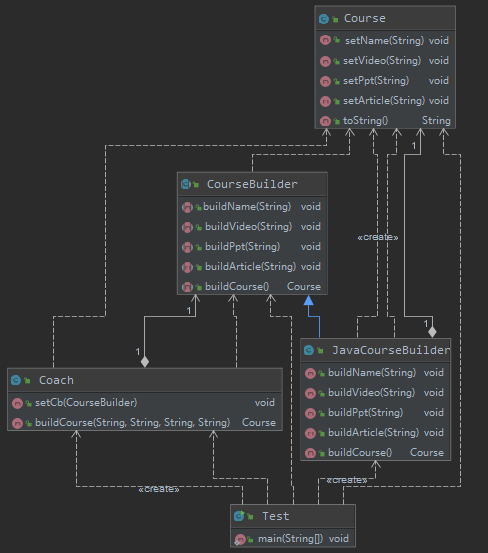

**链式调用建造者模式**
    
将具体建造者变成需要建造产品的静态内部类，且该静态内部类中所有对产品进行建造的方法都返回
this指针用于链式调用。这种方法可以让客户端仅仅依赖需要具体建造者而不需要使用coach对建造步骤
进行管理。同时，产品的属性可以设置默认值，当链式调用中没有进行相应设置时，就可以使用默认值。

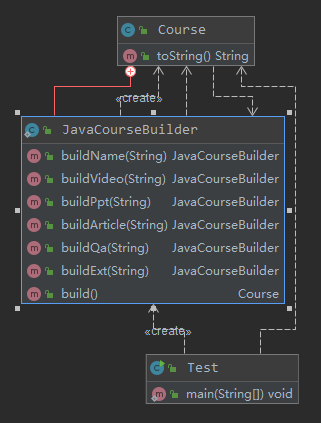

**源码体现**

- StringBuilder：StringBuilder的append各种重载方法返回值都是StringBuilder，典型的链式调用的建造者模式
- 在guava中CacheBuilder类，CacheBuilder.newBuilder().xxx.xxx.xxx.build()返回一个LRU算法的缓存。
- Spring的BeanDefinitionBuilder也是链式调用的建造者设计模式
- mybatis的SqlSessionFactoryBuilder类中各种build方法都是建造者模式，特别的，在其中一个build方法中，存在一个
**XMLConfigBuilder**的建造者类，它将复杂的XML建造步骤封装在内，可以认为该build方法是建造者中嵌套一个建造者：外层进行简单封装，内层实现具体复杂的XML建造逻辑。

### 2.5 单例

- 懒汉式：懒汉式线程不安全 -> synchronized线程安全 -> double-check lock（volatile，防止指令重排序）
- 静态内部类：JVM保证线程安全，同时实现延迟加载，指令重排是否发生对其它线程是透明的
- 饿汉式：static & static代码块
- 反序列化破坏单例模式：反序列化通过反射创建新对象obj，违背单例模式原则，需要添加**readResolve()**方法，将反射创建的obj覆盖为
单例对象
- 反射攻击：从反序列化破坏单例模式可以看出，反射可以攻击单例模式，通过将私有的构造器设置为可访问的即可完成攻击。对于饿汉式单例模式，在
- clone攻击：如果单例类实现了Cloneable接口并重写的clone()方法，也可以通过反射调用clone()方法创建单例类的拷贝，详见原型模式
私有构造器中加入一些防御代码可以防止反射攻击。对于懒汉式单例模式，防御性代码是否生效，取决于获取单例对象的线程和反射攻击线程执行顺序
- 枚举类单例:star:：枚举类的单例模式可以有效地防止单例攻击，底层Constructor、IO为它做了很多工作，可以通过jad查看枚举类的反编译结果：
    - 相当于static代码块中饿汉式单例模式
    - 枚举类被声明为final
    - 如果有abstract方法，枚举类又会被声明为abstract
    - abstract方法的实现会被放入到static代码块中
- 容器单例
- ThreadLocal：保证同一个线程内部对象是单一的，相比于同步锁而言是：空间换时间    

**源码体现**

- Runtime类：饿汉式单例模式，一个Runtime对应一个JVM运行时环境
- Desktop类：先同步锁从context中尝试获取Desktop单例对象，获取不到就向context中添加Desktop对象，类似于容器单例
- Spring中AbstractFactoryBean类的getObject()方法，会对当前对象判断是否是单例的
- mybatis中ErrorContext：使用了ThreadLocal形式的单例模式，如果从ThreadLocal中拿到的对象是null，则会创建一个新的ErrorContext
对象，并放入到ThreadLocal中

### 2.6 原型

原型实例指定创建对象的种类，并且通过**拷贝**这些原型创建新对象，而不需要调用构造函数。特别适合需要大量创建对象，并且对象初始化工作
需要消耗大量资源，创建过程复杂，成本高的场景。在Java中原型设计模式主要和Cloneable接口和clone()方法有关。

- 浅拷贝，只拷贝指针，不拷贝指针所指向地址的内容
- 深拷贝：不仅拷贝指针，还拷贝指针所指向地址的数据
    - 在Java中clone()方法被设置为protected，只有实现了Cloneable接口的类对象，才能调用clone()方法，String类型就不能调用clone()方法。
    - 从String不可变类型也可以看出，要实现深拷贝更简单的方法是：将类定义为不可变（immutable）
    - 对于既没有实现Cloneable接口，又是可变的类型，直接new出来即可：deepClone.sb = new StringBuilder(this.sb)
    - 基本类型能够自动实现深度拷贝
- 克隆破坏单例模式
    - 具体测试类为：prototype.clone包下的Test类
    - 解决方案：
        - 单例类不实现Cloneable接口（本身单例和Cloneable接口语义上就有矛盾）
        - clone()方法内部直接返回单例类实例instance
        

**源码体现**

- 只要实现了Cloneable接口，并且重写了clone()方法，都可以认为用到了原型设计模式
- java.util包下集合类实现了Cloneable接口，并且重写了clone()方法
- mybatis的CacheKey类并重写clone()方法   

## 三. 结构型             

### 3.1 外观

外观设计模式又称为门面模式，提供了统一的接口，用来访问子系统中的一群接口。外观设计模式定义了一个高层接口，让子系统更容易使用。适用于：
- 子系统越来越复杂，增加外观设计模式提供简单的调用接口
- 构建多层系统结构，利用外观对象作为每层入口，简化层间调用

外观设计模式能够简化调用过程，无需深入了解子系统，防止带来的风险，减少系统之间依赖，更好地划分层次间访问，符合迪米特法则。
但是，如果需要拓展子系统，容易引入风险，不符合开闭原则。

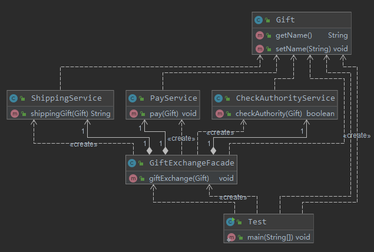

**源码体现**

- spring-jdbc：JdbcUtils类对原生JDBC进行一个包装，包括Connection、Statement、ResultSet等操作的相关处理封装
- mybatis：Configuration类下的newXxx方法，对MetaObject、ParameterHandler、ResultSetHandler等进行封装
- Tomcat：RequestFacade类对HttpServletRequest进行一次封装，例如getParameter()等。同时Request类和RequestFacade类都是
实现了HttpServletRequest接口，但是Request内部持有一个RequestFacade类对象。Tomcat中有很多XxxFacade类，都是外观模式
- Redis：Redis Sentinel可以看做是各个redis节点的一个外观，客户端直接通过redis sentinel实现故障自动转移，不需要关心redis节点具体细节

### 3.2 装饰者

装饰者设计模式：在不改变原有对象的基础上，将功能附加到对象上，提供了比继承更有弹性的替代方案。适用于拓展一个类的功能或者给一个类添加新的职责，
或者动态给一个对象添加职责，而且这些功能能够动态撤销。

优点：
- 比继承灵活，在不改变原有对象的情况下，给对象拓展功能
- 通过使用不同装饰类或者不同装饰类的排列组合（如果使用继承实现，会出现类爆炸问题），可以实现不同的效果。
- 符合开闭原则

缺点：
- 会出现更多的代码，更多的类，增加程序复杂性
- 动态装饰时，多层装饰时会带来复杂性，特别在调试的时候

**源码体现**

- JDK中IO流，涉及到BufferXxx，都是对普通的InputStream、OutputStream、Reader、Writer进行装饰增强。典型的装饰者是FilterInputStream，具体装饰类为
BufferInputStream
- Servlet中：ServletRequest、ServletResponse也是装饰者模式

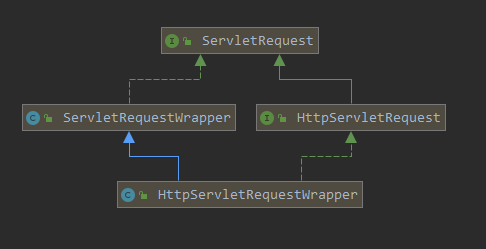

- mybatis：org.apache.ibatis.cache接口，特别的，在org.apache.ibatis.decorators包下有各种具体装饰者类实现，包括：FifoCache、LruCache、ScheduledCache、SynchronizedCache

### 3.3 适配器

适配器设计模式；将一个类的接口转换成客户端期望的另一个接口，使原本不兼容的类可以一起工作。适用于已存在的类，它的方法和需求不匹配时候，
适配器设计模式不是在软件设计初期考虑的问题，而是随着软件不断演进，需求不断增多，出现接口不兼容问题的解决方案（亡羊补牢）。

优点：
- 提高类的透明性和复用性，现有的类复用但是不必要改变需求
- 目标类和适配器类解耦，提高程序的可拓展性

缺点：
- 适配器编写过程需要全面考虑，可能会增加系统的复杂性
- 增加系统代码可读性难度

适配器两种模式：
- 类适配器：适配器类直接继承待适配的类

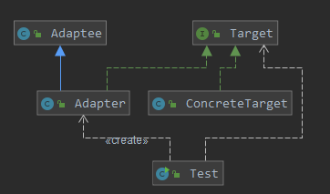

- 对象适配器：适配器内部持有带适配类的引用（可以通过构造函数注入）

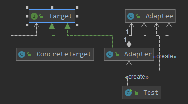

**源码体现**

- SpringMVC：HandlerAdapter接口，将对应的请求通过getHandlerAdapter转换成相应的适配器，然后使用对应适配器的handle方法，返回相应的ModelAndView对象
- SpringJPA：JpaVendorAdapter接口，具体实现类包括（AbstractJpaVendorAdaptor、EclipseJpaVendorAdaptor、HibernateJpaVendorAdapter），通过setDatabse()方法来适配不同的数据库

### 3.4 享元

享元模式减少对象数量，从而改善应用所需要的对象结构，运用享元模式能够有效地支持大细粒度的对象。常常应用于系统底层的开发，以便解决
系统性能问题。例如系统中有大量相似对象，需要缓冲池的场景。

优点：
- 减少对象的创建，降低内存中对象的数量，降低系统内存，提高效率
- 减少内存之外其它资源（例如时间、文件句柄、窗口句柄）的占用

缺点：
- 关注内部、外部状态，关注线程安全问题，使系统、程序的逻辑复杂化

**源码体现**：
- Integer类的valueOf方法，默认情况下如果值在\[-128, 127\]之间，直接从IntegerCache中获取，否则new创建Integer对象
- String类的常量池和Integer的IntegerCache类似，如果存在，直接拿，否则new出String对象，并放入到常量池中

### 3.5 组合

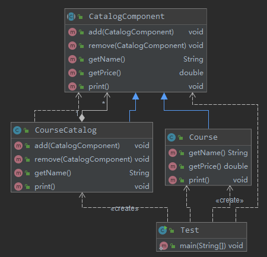

组合设计模式：将对象组合成树形结构以表示“部分-整体”的层次结构，组合模式使得客户端对于单个对象和组合对象保持一致的处理方式。适用于
客户端希望忽略组合对象和单个对象差异时，或者在处理一个树形结构时。组合模式非常明显的特征是：叶子对象和组合对象都要实现相同的接口或者
继承相同的抽象类。

优点：
- 清楚地定义分层次的复杂对象，表示对象的全部或者部分层次
- 让客户端忽略层次的差异，方便对整个层次结构进行控制，简化客户端代码

缺点：
- 限制类型时会比较复杂
- 设计更加抽象

**源码体现**
- java.util包下的集合类，例如HashMap、ArrayList都有对应的添加整个集合方法（putAll、addAll），添加的都是各自类型的父类，属于组合模式
- mybatis中SqlNode接口和对应实现类MixedSqlNode关系和代码中CatalogComponent抽象类以及CourseCatalog关系对应

### 3.6 桥接

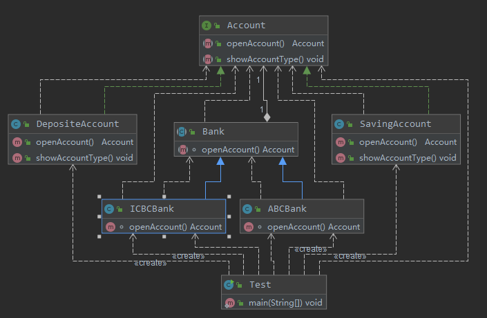

桥接设计模式：将抽象部分与它具体实现部分分离，使它们都可以独立地变化，通过组合的方式建立两个类之间的联系，而不是继承。适用于抽象和具体实现
之间增加更多灵活性场景，或者一个类存在两个独立变化的维度，并且这两个维度都需要独立进行拓展，使用桥接模式可以很好地避免子类爆炸的问题。

优点：
- 分离抽象部分和具体实现部分，提供了系统的可拓展性
- 符合开闭原则、合成复用原则

缺点：
- 增加了系统的理解和设计难度
- 需要正确地识别系统中两个独立变化的维度

**源码体现**
- Driver接口和各自实现类为一个独立维度，DriverManager类为另一个维度，DriverManager持有DriverInfo类，该类是对Driver类的封装，其内部
getConnection()方法是委托给Driver类去实现：**aDriver.driver.connect(url, info)**

### 3.7 代理

代理设计模式：为其它对象提供一种代理，以控制对这个对象的访问，代理对象在客户端和目标对象之间起到中介作用。适用于需要保护目标对象或者
增强目标对象的场景。

优点：
- 代理模式能够将代理对象和真实被调用的目标对象分离，一定程度上降低系统的耦合性，拓展性好，同时保护了目标对象

缺点：
- 代理模式会造成系统设计中类的数目增加，在客户端和目标对象增加一个代理对象，从而造成请求处理速度变慢
- 增加系统复杂度

代理的三种分类：

- 静态代理：代理类在程序运行前就已经定义好，与目标类的关系在程序运行前就已经确定，类似于企业和企业法律顾问的关系。
- jdk动态代理：jdk动态代理通过java.lang.reflect.Proxy类实现动态代理，会使用静态方法newProxyInstance(ClassLoader loader,
Class<?>\[\] interfaces, InvocationHandler handler)，自动生成一个代理对象。jdk动态代理中，目标类必须实现特定接口。
- cglib动态代理：在目标对象没有实现任何接口时，不能使用jdk动态代理，此时只能使用cglib动态代理。cglib动态代理是通过生成目标类的子类，
完成对目标类的增强，因此目标类不能是final的（目标方法不能是final的），cglib动态代理具体通过实现MethodInterceptor接口，并需要定义创建代理
类的方法，该方法内使用Enhancer增强器设置父类类型和回到函数，最终调用create()方法，返回代理对象。 

**源码体现**
- java.lang.reflect.Proxy：Proxy类的newProxyInstance()方法能够实现JDK动态代理
- spring：ProxyFactoryBean类核心方法是getObject()方法
- spring AOP功能：两个重要的类：JdkDynamicAopProxy（对JDK动态代理进行封装）、CglibAopProxy（对类进行代理增强）
- mybatis：MapperProxyFactory，Mapper的代理工厂，核心方法newInstance，通过这个代理可以在mybatis中仅仅编写interface文件即可，不需要具体实现类，具体
实现类是通过代理生成的。

## 四. 行为型 

### 4.1 模板方法

模板方法设计模式：定义了一个算法骨架，并允许子类为一个或者多个步骤提供具体实现，模板方法允许子类在不改变算法结构的情况下，重新定义算法的某些步骤。
适用于一次性实现一个算法的不变部分，并将可变的行为留给子类实现，各个子类中公共的行为被提取出来集中到一个公共的父类方法中，避免代码重复。

优点：
- 提高复用性
- 提高可拓展性，符合开闭原则

缺点：
- 子类数目增加，一定程度上增加系统实现复杂性
- 继承关系自身的缺陷，如果向父类中添加新的抽象方法，所有子类必须全部实现

**源码体现**：
- JDK中AbstractList类中addAll方法中有具体步骤实现add()方法，add()方法在AbstractList中是abstract的，由子类提供具体实现
- Servlet的service()方法，里面根据具体请求方法类型进行处理，不需要重写service()方法，只需要重写请求方式方法，例如doGet、doPost方法即可完成对应需求
- Mybatis中BaseExecutor类：该类中有四个抽象方法留给子类具体实现，doUpdate、doFlushStatements、doQuery、doQueryCursor方法。

### 4.2 迭代器

迭代器设计模式：提供一种方法，顺序访问一个集合对象中的各个元素，而又不暴露该对象的内部表示。适用于访问一个集合对象的内容而又不暴露它的内部表示。
为遍历不同的集合提供了同一接口。

优点：
- 分离了集合对象的遍历行为，将对象的存储和遍历分离

缺点：
- 因为分离导致类的数量增加，进而一定程度上增加了系统设计难度

**源码体现**
- java.util.Iterator接口：标准的迭代器设计模式，例如ArrayList中Itr内部类实现了Iterator接口，完成对ArrayList内部元素的遍历
- Mybatis中DefaultCursor类实现了Cursor接口，内部持有一个CursorIterator，并通过iterator()方法返回适当的CursorIterator对象

### 4.3 策略

策略设计模式：定义了算法家族，分别封装起来，让它们可以相互替换，依次让算法的变化不会影响到客户端。适用于系统中有很多类，而这些类之间的区别
仅仅在于它们的行为不同，或者一个系统需要动态的在几个算法之间选择其中一种。

优点：
- 符合开闭原则
- 可以有效避免重复使用多重条件转移语句
- 可以提高算法的保密性和安全性

缺点：
- 客户端必须知道所有的策略类，并自行决定使用哪一个策略类
- 产生很多的策略类，增加类的个数，提高系统设计难度

**源码体现**
- JDK中Comparator接口：定义了比较的策略，当需要对集合进行自定义排序时，只需要传入对应的比较策略即可
- Spring中InstantiationStrategy：定义了Bean的初始化策略，有两个实现类（且有继承关系）：SimpleInstantiationStrategy和CglibSubclassingInstantiationStrategy

### 4.4 解释器

解释器设计模式：给定一个语言，定义它的一个文法表示，并定义一个解释器，这个解释器使用该表示来解释语言中的句子。简单说：为了解释一种语言，而为语言
创建的解释器。适用于某个特定问题发生频率非常高的情况。

优点：
- 语法由很多类表示，容易改变及拓展语言

缺点：
- 当语法规则非常多时，增加了系统复杂性

**源码体现**
- java.util.Pattern：JDK的正则表达式就是标准的解析器设计模式
- Spring的EL表达式ExpressionParser

### 4.5 观察者

观察者设计模式：定义了对象之间的一对多依赖，让多个观察者对象同时监听某一个主题对象，当主题对象发生变化时，它的所有依赖着（观察者）
都会接收到通知并更新。适用于需要关联行为的场景（广播），建立一套触发机制。

优点：
- 观察者和被观察者之间建立了一个抽象的耦合
- 观察者模式支持广播同行

缺点：
- 观察者之间有过多的细节依赖、提高时间消耗和程序复杂度
- 使用要得当，要避免出现循环调用

**源码体现**
- Spring中配置的RequestContextListener最终实现的接口是jdk util包下的EventListener，完成时间监听相关任务，也是一个观察者模式体现
- Guava中EventBus类中的register()和unregister()方法用于添加或解除观察者，post()方法用于向观察者分发消息，通过@Subscribe注解的方法，
让所有观察者接受对应的消息